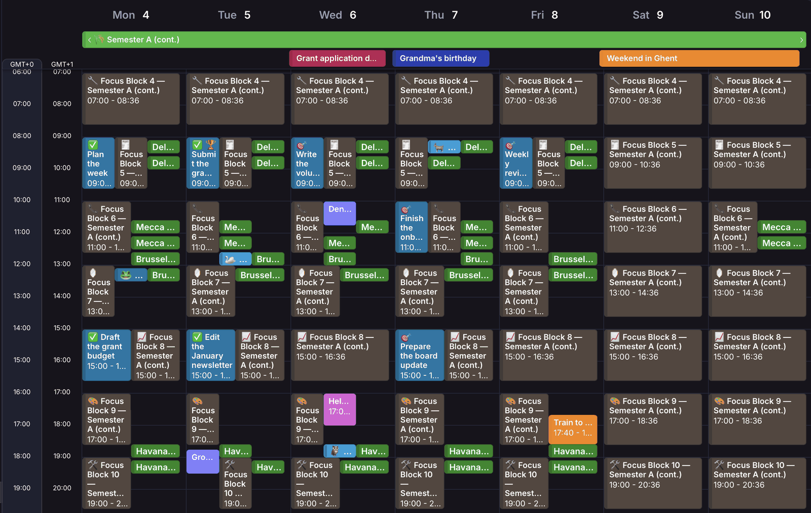
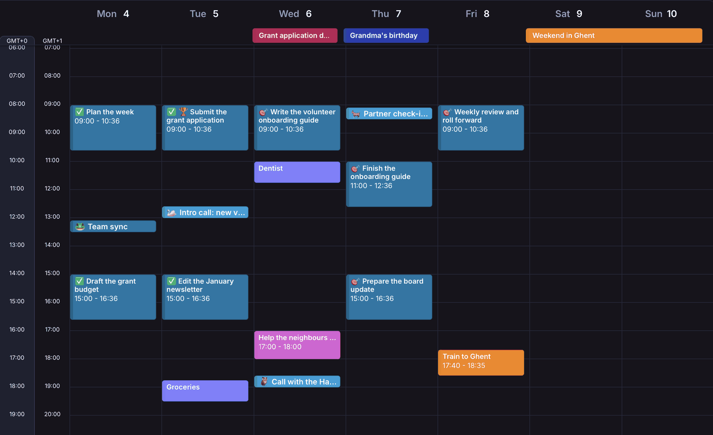
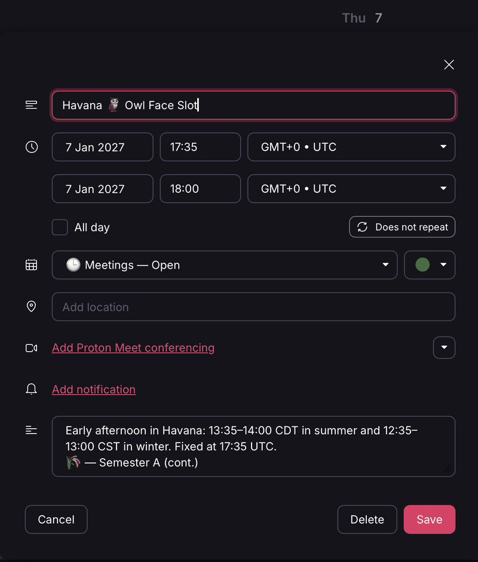
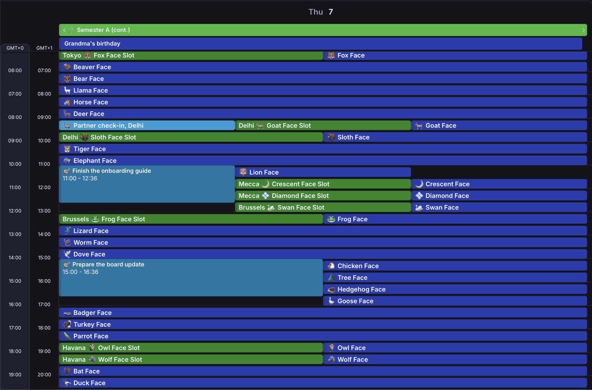

# 🧿 calmoji

**Calendar rituals for people who drift off task.**

*A [Proper Tools](https://propertools.be) production, made in Brussels.*

[](https://github.com/propertools/Calmoji-Forge/actions/workflows/ci.yml)
[](LICENSE)
[](https://www.python.org/downloads/)

If time slides away from you, if a blank week feels like a wall, or if you
lose the thread between "I should work on that" and actually doing it,
calmoji gives your calendar a shape before you have to make any decisions.

It produces ready-made calendar layers: the seasons of your year, a daily
palette of focus blocks, and humane meeting windows across time zones. You
toggle them on to plan and off to work. When you want to use a block, you
**claim** it by copying it into your own calendar. You never build a
schedule from scratch, and you never break the structure underneath.


*The Map on: a made-up week of open focus blocks (brown), meeting slots
(green) and the blocks already claimed (blue).*


*The Map off: the same week, showing only what was chosen.*

No app, no account, no subscription fee. Just `.ics` files that work in
Apple Calendar, Google Calendar, Outlook, Proton Calendar, Fastmail,
Thunderbird, and anything else that speaks the iCalendar standard.

**About as much data sovereignty as paper.** calmoji never sees your
calendar. It makes files; you import them; everything you plan stays in
your own calendars, with whichever provider you choose. And since almost
every calendar app can import and export `.ics`, there's no lock-in:
change apps whenever you like, and take your structure and your plans
with you.

---

## 🚀 Get the calendars

**In four steps:**

1. Download **`calmoji-artifacts-vX.Y.Z.zip`** from the
   [latest release](https://github.com/propertools/Calmoji-Forge/releases/latest)
   and unzip it.
2. In your calendar app, create a calendar for each layer (🌗 Seasons,
   🧠 Focus — Open, 🕒 Meetings — Open, 🧿 Emoji Clock), plus one of your
   own for what you claim, such as 🎯 Focus — Claimed.
3. Import each file into its layer's calendar: the year's 🌗 and 🧿 files,
   and this month's and next month's 🧠 and 🕒 files.
4. Claim time for this week's meetings, projects and tasks by copying open
   blocks and slots into your own calendars.

The details follow.

Download the ready-made calendars for **2026–2039** from the
[latest release](https://github.com/propertools/Calmoji-Forge/releases/latest):
grab **`calmoji-artifacts-vX.Y.Z.zip`** (X.Y.Z is the release's version
number) and unzip it.

Inside, pick an alignment and stick with it:

* **`academic`**: each year runs September → August (school, university,
  research, or anyone whose year turns in autumn)
* **`calendar`**: each year runs January → December

Then open the folder for the year you want, for example `2026/academic/`:

```
2026/academic/
├── seasons_2026.ics             ← 🌗 Seasons: the seasons of your year
├── emoji_clock_2026.ics         ← 🧿 Emoji Clock
├── focus/
│   └── focus_2026-09.ics …      ← 🧠 Focus — Open, one file per month
└── meetings/
    └── meetings_2026-09.ics …   ← 🕒 Meetings — Open, one file per month
```

### Importing

Create one calendar per layer in your calendar app (for example
"🧠 Focus — Open", "🕒 Meetings — Open"), then import each file into its own
calendar. That's what lets you colour each layer and switch it on and off
on its own; the [playbook](docs/PLAYBOOK.md) explains why it matters. Give
each layer its own colour; the playbook suggests a
[calm starting palette](docs/PLAYBOOK.md#colours). In apps that create a
calendar when you import, the file already names it for you.

* **Apple Calendar:** File → Import → choose the file → choose the calendar.
* **Google Calendar:** Settings → Import & export → choose the file and the
  destination calendar.
* **Outlook, Fastmail, Thunderbird and others:** use your app's "Import"
  option.

Tips for v0.1:

* **Start with this month and next.** Focus blocks and meeting slots come
  one file per month; add more months as you go. It's a gentler start
  anyway.
* **Months are in UTC.** If you're west of UTC, an event late in the
  evening on the last day of a month may be in the next month's file.
* **Every file is kept under 600 events and 512 KB**, so it fits the
  import limits reported for Google, Outlook and Proton.
* **Proton Calendar accepts events only up to the end of 2037.** Proton
  users can use the 2026–2036 folders, plus 2037 in the `calendar`
  alignment. 2037 `academic` runs into 2038, and 2038–2039 are past
  Proton's limit. Every other app should take them all, and
  [the year-2038 section below](#-testing-for-the-year-2038-problem) asks
  you to check exactly that. Any other year you can
  [generate yourself](#-regenerating-the-calendars-yourself).
* To refresh a layer later, delete that calendar, recreate it and import
  again. Your own plans live in your own calendars and are untouched.

Subscribable feeds that update themselves, and a website to browse and
download individual files, are coming in v0.2. See the
[roadmap](#-roadmap).

Calendar apps differ in small ways. If something doesn't work in yours,
please [open an issue](https://github.com/propertools/Calmoji-Forge/issues);
we'll fold what we learn into these docs.

### Upgrading from v0.1.0

Delete the old calmoji calendars and import fresh. Event times and
identifiers changed (see the [changelog](CHANGELOG.md)), so importing over
the old ones would leave you with duplicates.

### Upgrading from v0.1.1 or v0.1.2

Only one thing changed in the calendars you already have: the old 🗝️
markers (one a week in 🧠 Focus — Open, one a year in 🧿 Emoji Clock) are
gone from the new files, but they stay in your calendars until you
re-import. To drop them, delete the 🧠 Focus — Open and 🧿 Emoji Clock
calendars and import fresh. Nothing else changed, so nothing else needs
re-importing.

### 🕰 Testing for the year-2038 problem

Many systems count time as a signed 32-bit number of seconds since 1970, and
that number runs out at 03:14:07 UTC on 19 January 2038: the next second
doesn't fit. Software built on it can lose or misplace events after that
moment. The ready-made calendars run to 2039 so you can check your own
calendar app.

* The 2037 `academic` and 2038 `calendar` folders contain January 2038. On
  19 January 2038, ✍️ Focus Block 2 (02:00–03:36 UTC) and the Emoji Clock's
  🦝 Raccoon slot (03:05–03:30 UTC) span that exact second.
* The 2037 `academic` Emoji Clock also tests recurring events: its daily
  repeats run on into August 2038.

**How to test:** import `2038/calendar/focus/focus_2038-01.ics` and
`2037/academic/emoji_clock_2037.ics` into a 🧪 Sandbox calendar, then look at
19 January 2038. Events missing, at the wrong time, or an import error mean
the app has a problem.

If you find a calendar app that fails, please
[open an issue](https://github.com/propertools/Calmoji-Forge/issues) naming
the app, its version and what you saw. Proton Calendar's documented limit
(events only up to the end of 2037) doesn't count.

---

## 🧭 How to use it

The short version:

1. **The Map is read-only.** calmoji's layers (🌗 Seasons,
   🧠 Focus — Open, 🕒 Meetings — Open and 🧿 Emoji Clock) show what's
   *available*. Don't edit them.
2. **Claim, don't edit.** To use a focus block or meeting slot, duplicate
   it into one of your own calendars (for example "🎯 Focus — Claimed").
3. **Mark progress in the title.** 🎯 means planned, ✅ means done. Search
   for 🎯 to find what slipped; search for ✅ for your weekly review.
4. **Regenerate without fear.** Because your plans live in your own
   calendars, you can delete and re-import calmoji's layers any time.
   Nothing you've claimed is lost.
5. **Layers are privacy controls.** When scheduling with someone, show only
   the layers they should see.

The full pattern, with a suggested set of calendars and the weekly loop,
is in **[docs/PLAYBOOK.md](docs/PLAYBOOK.md)**. It's a starting point, not a
rulebook: start small and adapt it.

Prefer to plan with an AI assistant? See the
[playbook](docs/PLAYBOOK.md#optional-an-ai-agenda-steward).

---

## 🗂 What's in each layer

Every event is marked **private** and **free** (it won't make you look
busy). All times are fixed in **UTC**; your calendar app shows them in your
local time.

### 🌗 Seasons

The year is divided into eight phases, each an all-day marker so you always
know which mode you're in. Names come from the academic year; in the
`calendar` alignment the same arc starts on 1 January.

| Phase | Length | Open meetings? |
|---|---|---|
| 🌱 Semester A (Seed) | 14 weeks | yes |
| ❄️ Winter Break | 2 weeks | no |
| 🌾 Semester A (cont.) | 25 days | yes |
| 🪷 Downtime A→B | 2 weeks | yes |
| 🔥 Semester B (Flame) | 19 weeks | yes |
| 🐚 Summer Rest | 15 days | no |
| 🧠 Deep Work Phase | 6 weeks | yes |
| 🍂 Autumn Drift | until the year turns | no |

### 🧠 Focus — Open

Twelve 96-minute blocks a day, starting every two hours on the hour (UTC),
every day of the week, with a 24-minute breather between them. Why 96
minutes? It's four sides of an LP, so if you work to records, the flips keep
time for you. Each block has a theme glyph: 🧠 deep thinking, ✍️ writing,
📚 reading, 🔧 technical, 🧾 admin, 📞 comms, 🪞 reflection, 📈 analysis,
🎨 creative, 🛠️ maintenance, ⚖️ decisions, ⛩️ closure. You'll only ever use
the few that fall in your waking hours. They come one file per month.

### 🕒 Meetings — Open

25-minute windows starting at :05 or :35 past the hour, two per city,
placed around early afternoon local time in Tokyo, Delhi, Mecca, Brussels,
Havana and Seattle (Auckland is available when you generate them
yourself). Slots run Monday–Friday (Sunday–Thursday for Mecca) and pause
during breaks. Each slot carries the EBI48 emoji for its half-hour, and they
come one file per month.

Like everything in calmoji, slots are fixed in UTC all year, and your
calendar app shows them in your local time. Each slot's description says
exactly when it falls locally.



### 🧿 Emoji Clock

I designed EBI48 after years of watching global technical standards
calls spend their last ten minutes on time-zone arithmetic: which
city, which day, has London changed its clocks yet, does that clash with
Jane's carpool next Thursday. Everyone was doing mental maths, juggling
guilt and triage, just to find a time.

EBI48 gives each of the day's 48 half-hours an emoji that means the same
moment everywhere, anchored at :05 and :35 UTC. Your calendar shows each
one at your local time, so nobody converts anything out loud. Instead of
doing sums, you **pick a day and look for free animals at acceptable
times**. See [EBI48-README.md](EBI48-README.md).


*Thursday, seen from Brussels. Delhi's 🐐 slot sits beside the 🐐 on the
clock, because 🐐 is 08:05 UTC everywhere.*

### ⚠️ Known limitations

* **Daylight saving time moves meeting slots in local time.** A slot keeps
  the same UTC time all year, so in cities with daylight saving time
  (Brussels, Havana, Seattle) its local time is an hour earlier in winter
  than in summer. Each slot's description says exactly when it falls,
  summer and winter.
* **Months are in UTC.** An event late in the evening on the last day of a
  month, for someone west of UTC, may be in the next month's file.

---

## 🧭 Core principles

### 1️⃣ UTC everywhere

All datetimes are timezone-aware and normalized to **UTC**. No floating
times. No silent conversions.

### 2️⃣ Exclusive end semantics

Phases use `[start, end)`. End is exclusive. That means correct duration
math, no off-by-one errors, clean boundaries, and deterministic tests.

### 3️⃣ Deterministic output

Stable UIDs, stable emoji mappings, stable file structure. The same inputs
always produce byte-identical files, on any machine and any supported
Python version. CI checks this on every commit: it generates a sample year
twice, and on Python 3.9 and 3.13, and compares the files byte for byte.

Even `DTSTAMP`, which RFC 5545 requires on every event, is a fixed,
documented constant rather than "now", so that files stay reproducible.

---

## 🛠 Regenerating the calendars yourself

You only need this if the published calendars don't cover what you want:
another year, another alignment, or different layers.

```bash
git clone https://github.com/propertools/Calmoji-Forge.git
cd Calmoji-Forge
```

Generate. Nothing to install, no third-party packages: any Python 3.9 or
newer works, including the `python3` from Apple's Command Line Tools (a Mac
offers to install them the first time you run `python3`).

```bash
python3 calmoji.py --year=2027 --calendar-alignment=academic
```

By default the files go to `output/<year>/<alignment>/`, so different years
and alignments never mix. calmoji only writes into a folder that is empty or
that it made itself (it leaves a `.calmoji-output` file there), and re-running
replaces its own files in that folder. calmoji recognises its own files by
name. Anything else in its folder, including another `.ics` file, makes it
refuse without deleting anything. Any other non-empty folder is refused,
untouched.

Alignments: `academic`, `calendar`, `fiscal_us`, `fiscal_eu`,
`japanese_school`, `indian_fiscal`.

Options:

```bash
--year=YYYY          # required
--output-dir=DIR     # default: output/<year>/<alignment>/
--dry-run            # preview what would be written, month by month
--no-meetings        # skip meeting slots
--no-focus           # skip focus blocks
--no-ebi48           # skip the EBI48 layer
--include-oceania    # add Auckland meeting slots
```

Output for one year (the files are in `output/2027/academic/` here):

```
output/2027/academic/
├── .calmoji-output                     ← marks the folder as calmoji's
├── seasons_2027.ics
├── emoji_clock_2027.ics
├── focus/
│   └── focus_<YYYY-MM>.ics …           ← one file per month
└── meetings/
    └── meetings_<YYYY-MM>.ics …        ← one file per month
```

Optionally, install it as a package to get a `calmoji` command. Use a
virtual environment, and upgrade pip first (the pip that comes with Apple's
Python is old):

```bash
python3 -m venv .venv
source .venv/bin/activate
python3 -m pip install --upgrade pip
python3 -m pip install -e .
calmoji --year=2027
```

Working on calmoji itself? `python3 -m pip install -e '.[dev]'` adds the
test, lint and type-check tools, and `bash scripts/preflight.sh` runs CI's
main checks on your machine (tests with coverage, ruff, black, mypy) plus a
reproducible release-bundle build. CI also tests Python 3.9 through 3.13,
compares output across Python versions, and runs on macOS's `/usr/bin/python3`.

If you regenerate a year we publish and get a different file, that's a
bug. Please open an issue.

---

## 📍 Roadmap

v0.1 is deliberately small: it works today, and it's what I use myself. Planned
for v0.2, in no promised order:

* **Subscribable calendars that update themselves**: rolling feeds that
  always cover this year and next, so there's nothing to re-import each
  year.
* **A website, calmoji.propertools.be,** to browse the calendars and
  download single files or a zip per year, without unpacking the whole
  archive.
* **Releases built automatically** from a git tag, with byte-identical
  output checked in CI.

Further out, and explicitly not in v0.1.x:

* **A strict, well-specified input reader.** calmoji only writes `.ics`
  today. A reader is a bigger, careful piece of work: calendar files arriving
  from elsewhere are untrusted input, and a safe reader should recognise
  exactly the shape it accepts and reject anything else, rather than guessing
  at malformed or ambiguous input. The aim is predictable, boring,
  interoperable behaviour, with resource limits and its own threat model in
  [`SECURITY.md`](SECURITY.md) when the work begins.

Ideas and calendar-app quirks are very welcome in
[issues](https://github.com/propertools/Calmoji-Forge/issues).

---

## 🧪 Test discipline

```bash
pytest --cov=calmoji --cov-report=term-missing
```

Coverage includes exclusive-end correctness, ISO week boundaries across
year transitions, deterministic UID format, emoji uniqueness and
completeness, slot duration and cadence guarantees, ICS folding and
unfolding, and a guard against stray `date` imports.

This is a calendar system that proves its invariants.

---

## 🧭 Design philosophy

calmoji is part of the [Proper Tools](https://propertools.be) toolchain.

It is designed to:

* Survive infrastructure drift
* Remain interpretable in low-bandwidth environments
* Encode meaning without dependency on platforms
* Preserve coherence over spectacle

If printed on paper, the system still works.

If imported into any standards-compliant calendar, it still works.

If nothing survives but glyphs and dates, it still makes sense.

---

## 🙌 Credits

* Made by [Proper Tools SRL](https://propertools.be)
* Ritual design: Trey Darley
* Engineering discipline: Trey Darley
* AI pair engineering: ChatGPT, Claude
* Glyph architecture: [EBI48](EBI48-README.md)

---

## 🔐 Security

See [SECURITY.md](SECURITY.md) for the coordinated-disclosure policy and
contact channel. Reports of output non-determinism, RFC 5545 drift, or
malformed-input handling are explicitly in scope.

---

## 📜 License

* Code: [MIT License](LICENSE)
* EBI48 mapping table: CC0 1.0 (public domain where possible)

---

> Calendars should be precise.
> Time should be encoded cleanly.
> Coherence is not optional.

Fox Face, out! 🦊
